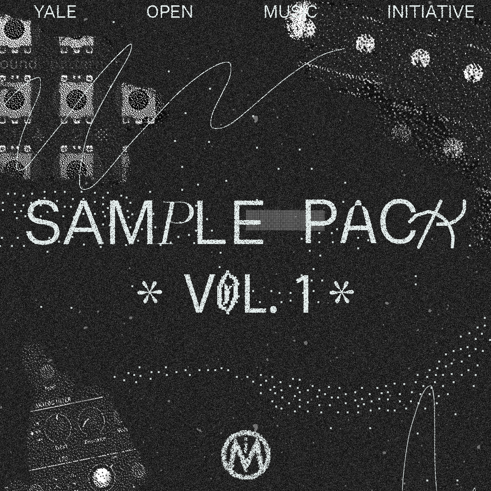

# OMI Sample Pack Vol. 1
The OMI Sample Pack is a royalty free collaborative sample pack. It was created during a workshop at Yale led by Kaloyan Kolev in Spring 2022. Some of the synths recorded include: Novation Peak, Korg Monotron Delay, Stylophone Beatbox.

You can download it from GitHub or [Google Drive](https://drive.google.com/drive/folders/14AkjQayIhHLt1MshBs49RKkFvjyCUEdv?usp=sharing). You are welcome to use and modify any of the sounds in your work without attribution.

# About OMI
The mission of the Yale Open Music Initiative (OMI) is to foster a community of practice around the development and use of open source audio tools in the context of artistic expression. OMI facilitates the exploration of creative computation and digitally-enabled music production though weekly workshops, reading groups and through associated research projects. OMI is an open, welcoming community that values diversity in all forms. Our programming is driven entirely by our membership and our membership is open to all.
